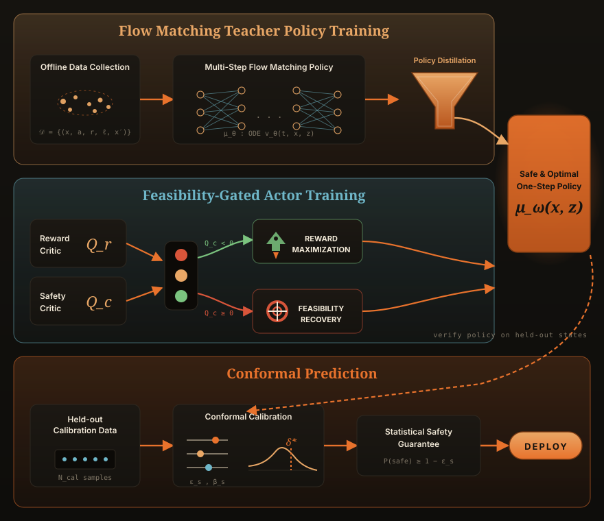
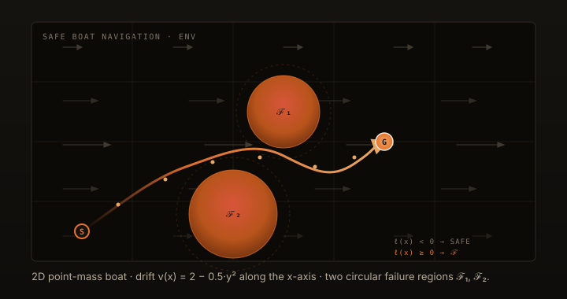
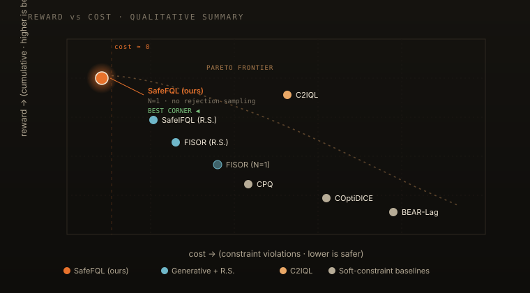
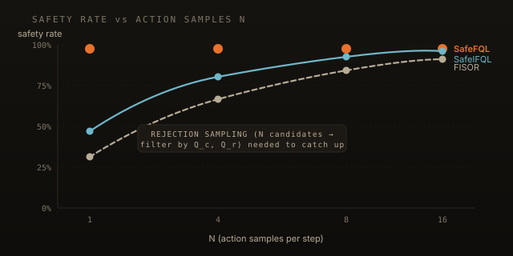
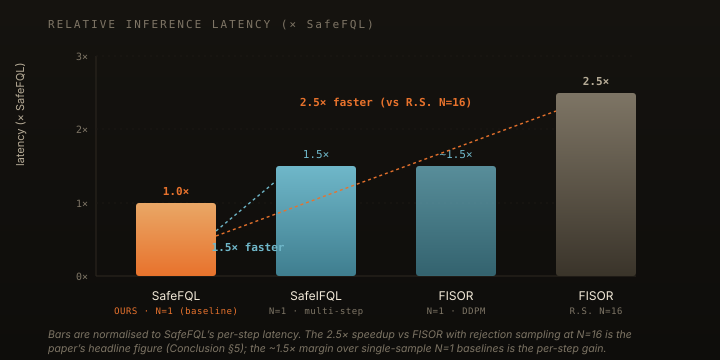

> [!note]
> **TL;DR.** Safe offline RL has two practical pain points: soft cost
> penalties leak occasional violations, and safe generative policies pay
> a steep latency tax at inference. **SafeFQL** fixes both — it uses a
> Hamilton–Jacobi-style *reachability* critic for hard safety, and
> distills a flow-matching teacher into a **single forward pass** for
> the deployed policy. No rejection sampling, no iterative denoising,
> **~1.5× faster** than single-step generative baselines and **2.5×
> faster** than diffusion + rejection sampling at N=16, and lower
> constraint violations across boat navigation and Safety Gymnasium.
>
> **Paper:** [arXiv:2603.15136](https://arxiv.org/abs/2603.15136) ·
> **Venue:** RLC 2026

---

## Why this paper exists

Imagine you have a bunch of recorded sensor logs from a robot — driving
data, manipulator trajectories, whatever — and you want to learn a
controller from it that **never crashes** when you redeploy it. That is
the *safe offline RL* setting. Two things make it brutally hard:

1. **Hard safety, not soft penalties.** Most offline safe RL methods
   keep the *expected* cumulative cost under a budget — fine for
   averages, useless when a single violation is unacceptable
   (a collision, a torque limit overshoot, a stall).
2. **Latency at deployment.** Modern safe-RL methods that *do* model
   action multimodality well — diffusion policies, flow-matching
   policies — pay for it at inference. Diffusion needs ~10–50 reverse
   steps; "rejection sampling" then draws *N* candidate actions and
   filters them through cost / reward critics. That is not okay in a
   high-frequency control loop.

SafeFQL keeps the expressivity of generative policies while collapsing
inference back to a **single network forward pass**, and it replaces the
soft cost budget with a **state-wise, reachability-aware** safety value
function. The whole pipeline trains entirely from offline logs.

---

## The pipeline at a glance


*Figure 1. The SafeFQL pipeline. Train two value heads on offline data
(a reward critic and a reachability-based **safety critic**), distill a
multi-step flow teacher into a one-step student, optimize the student
with a **feasibility-gated** actor loss, then post-hoc calibrate the
safety boundary with conformal prediction. Only the orange one-step
actor runs at deployment.*

There are four phases, and they're trained sequentially:

1. **Critics.** Learn `Q_r, V_r` (reward) and `Q_c, V_c` (safety).
2. **Flow.** Train a flow-matching behaviour cloner `μ_θ`, then
   distill it into a one-step student `μ_ω`.
3. **Gate.** Optimise `μ_ω` with a *feasibility-gated* objective — when
   the action is predicted unsafe, *only* the safety gradient flows;
   when it's predicted safe, *only* the reward gradient flows.
4. **Calibrate.** Use conformal prediction on a held-out set to find a
   correction `δ*` so the deployed policy comes with a finite-sample
   probabilistic safety guarantee.

The rest of this post unpacks each piece in plain language.

---

## Phase 1 — Critics

### Reward critic: standard IQL

We use **Implicit Q-Learning** (IQL) for the reward side. The trick is
that IQL never queries the actor while learning the critic — it learns
a value function `V_r(x)` that tracks a *high quantile* of the in-sample
Q distribution under the behaviour policy:

$$
\mathcal{L}_{V_r}(\psi_r) \;=\; \mathbb{E}_{(x,a)\sim\mathcal{D}}\big[\, L_\tau\big(Q_r(x,a;\phi_r) - V_r(x;\psi_r)\big)\big],
$$

where $L_\tau(u) = |\tau - \mathbb{1}\{u<0\}|\,u^2$ is the **expectile
loss**. With $\tau$ close to 1 the loss upweights positive residuals, so
$V_r$ implicitly captures the advantage of better-than-average actions
**without ever evaluating the policy** — a major source of stability.
Then the standard one-step Bellman regression updates $Q_r$:

$$
y_r = r + \gamma\, \bar{V}_r(x'), \qquad
\mathcal{L}_{Q_r}(\phi_r) = \mathbb{E}_{\mathcal{D}}\big[(Q_r(x,a;\phi_r) - y_r)^2\big].
$$

### Safety critic: reachability, not cumulative cost

This is where SafeFQL departs from the usual safe-RL recipe. Instead of
learning a *discounted cumulative cost*, we learn a **Hamilton–Jacobi
reachability** value:

$$
V_\ell^*(x_0) \;:=\; \inf_\pi\; \sup_{t\in[0,T]} \ell(x_t),
$$

where $\ell(x)$ is a signed safety margin (negative = safe, positive =
inside the failure set $\mathcal{F}$). This is a **worst-case** quantity
along the trajectory, not an average. The critic is trained with a
**max-backup** Bellman recursion:

$$
y_c(x, a, x') \;=\; \max\big\{\,\ell(x),\; \gamma\, \bar{V}_c(x')\,\big\}.
$$

Read this carefully: a low safety margin **anywhere** in the future
propagates backward to the current state. So $Q_c(x,a) < 0$ now means
not only "I'm safe right now" but "the predicted future evolution stays
safe under behaviour-like actions". That's a *much* stronger statement
than a soft cost budget.

> [!tip]
> Because the targets are a **max**, you can't use the usual *min* trick
> from clipped double Q-learning. SafeFQL uses two safety Q-networks and
> takes their **maximum** — the most pessimistic estimate — to avoid
> over-optimistic feasibility at out-of-distribution next states.

---

## Phase 2 — Flow teacher → one-step student

Diffusion-style policies model multimodal behaviour beautifully, but
they need many denoising steps at inference. **Flow matching** is the
deterministic cousin: it learns a velocity field `v_θ(t, x, ·)` that
transports a Gaussian latent `z` to the action distribution by
integrating an ODE.

```python
# Flow-matching loss for the behaviour teacher μ_θ.
import torch, torch.nn.functional as F

def flow_loss(mu_theta, x, a):
    """`mu_theta(x, x_t, t)` predicts the velocity field.
    `x_t = (1-t)*z + t*a` is the straight-line interpolation
    from noise z to the target action a."""
    z = torch.randn_like(a)
    t = torch.rand(a.shape[:1], device=a.device).unsqueeze(-1)
    x_t = (1 - t) * z + t * a
    target = a - z                       # ground-truth velocity
    pred   = mu_theta(x, x_t, t)
    return F.mse_loss(pred, target)
```

At inference you'd normally integrate this ODE for, say, 10 steps —
expressive, but slow. SafeFQL **distills** the teacher into a one-step
student `μ_ω(x, z)` that maps state + noise straight to an action:

$$
\mathcal{L}_{\text{distill}}(\omega) = \mathbb{E}_{(x,z)\sim \mathcal{D}\times \mathcal{N}(0,I)}\,\big\| \mu_\omega(x,z) - \tilde{\mu}_\theta(x,z) \big\|_2^2,
$$

where $\tilde{\mu}_\theta(x, z)$ is the action you get from a *single*
integration step of the trained flow model. The student keeps the
expressivity (it's still conditioned on a latent `z`, so it can
represent multimodal action distributions) but at deployment it costs
**one forward pass through a feedforward network**.

---

## Phase 3 — Feasibility-gated actor

You now have a reward critic, a safety critic, and a one-step actor.
How do you optimise the actor?

**The naive way (don't):**

$$
\mathcal{L}_{\text{actor}}^{\text{naive}}(\omega) \;=\; \mathbb{E}\big[-Q_r(x, a_\omega) + \eta \cdot \max(0, Q_c(x, a_\omega))\big] + \lambda\,\mathcal{L}_{\text{distill}}(\omega).
$$

Two terms competing for the same gradient. Near the safety boundary —
where $Q_c$ is small but positive — a big enough reward gradient just
elbows the actor into the unsafe region. Tuning $\eta$ per task without
online interaction is, frankly, a wish.

**SafeFQL's fix: an exclusive gate.** Define a binary feasibility flag

$$
\zeta(x, z) \;=\; \mathbb{1}\big\{Q_c(x, \mu_\omega(x, z)) < 0\big\},
$$

and use it to **switch** between two regimes instead of summing them:

$$
\mathcal{L}_{\text{actor}}(\omega) \;=\; \lambda\,\mathcal{L}_{\text{distill}}(\omega) \;+\; \mathbb{E}\big[\, \underbrace{\zeta\cdot(-Q_r)}_{\text{maximize reward}} \;+\; \underbrace{(1-\zeta)\cdot \max(0, Q_c)}_{\text{recover feasibility}} \,\big].
$$

In code, the actor update is one line:

```python
# Feasibility-gated actor loss for SafeFQL.
def actor_loss(mu_omega, mu_theta_one_step, Q_r, Q_c, x, z, lam=10.0):
    a       = mu_omega(x, z)                 # one-step actor output
    a_teach = mu_theta_one_step(x, z)        # frozen 1-step teacher
    distill = ((a - a_teach) ** 2).mean()    # behaviour anchor

    qc = Q_c(x, a)
    qr = Q_r(x, a)
    feasible = (qc < 0).float()              # ζ
    reward_term  =  feasible      * (-qr)
    safety_term  = (1 - feasible) * qc.clamp(min=0)
    return lam * distill + (reward_term + safety_term).mean()
```

Three terms, three jobs:
- `distill` keeps the actor inside the dataset's behaviour support — at
  all times, regardless of feasibility.
- `feasible · (−Q_r)` chases reward, but **only when the current action
  is already predicted safe**.
- `(1 − feasible) · max(0, Q_c)` pulls the actor back toward feasibility
  when it isn't, **with no reward signal contaminating the recovery**.

> [!important]
> The point of the gate is *strict priority*: safety first, reward
> second. Reward and safety gradients are never pointing in opposite
> directions at the same time. That's what tames the instability that
> Lagrangian methods are famous for.

---

## Phase 4 — Conformal calibration of the safety boundary

The safety critic is learned from finite data, so the level set
$\{x : V_c(x) < 0\}$ is *almost* the safe region — not exactly. Some
states it labels "safe" might actually trigger a violation under the
learned policy.

The fix is a **uniform correction margin** $\delta^*$ that pulls the
boundary inward:

$$
\delta^* \;:=\; \min_{x\in\mathcal{X}}\; \big\{ V_c(x) \;:\; V_c^\pi(x) \ge 0 \big\}.
$$

Sub-$\delta^*$ states are guaranteed safe under the learned policy. We
estimate $\delta^*$ with **split conformal prediction** on a held-out
calibration set: sample $N_s$ states, score them with $V_c^\pi(x)$, take
a quantile. The result is a probabilistic guarantee:

$$
\mathbb{P}_{x \sim \mathcal{S}_{\delta^*}}\big(V_c(x) < 0\big) \;\ge\; 1 - \epsilon_s, \quad \text{with confidence } 1 - \beta_s.
$$

In practice for our benchmarks the boundary was already tight — most
environments calibrated to $\delta^* = 0$, and only Hopper / Walker2D
needed a small negative offset.

---

## The benchmark — Safe Boat Navigation

To stress-test SafeFQL on a setting where you can *see* the safety
landscape, we built a small 2D navigation benchmark.


*Figure 2. The Safe Boat Navigation environment. A 2D point-mass boat
must reach the goal **G** from start **S** while threading two circular
failure regions $\mathcal{F}_1, \mathcal{F}_2$. The river drift is
state-dependent — fastest along the centre line — so optimal trajectories
are not straight lines. The copper curve is a SafeFQL rollout.*

The dynamics are simple but adversarial:

$$
x_{1,t+1} = x_{1,t} + (a_{1,t} + 2 - 0.5\, x_{2,t}^2)\,\Delta t,\qquad
x_{2,t+1} = x_{2,t} + a_{2,t}\,\Delta t,
$$

with $a_1^2 + a_2^2 \le 1$. The drift term $2 - 0.5\,x_2^2$ is the
catch — going straight into the obstacle on the centre line is *fast*
because the river is helping you, and the safety value function has to
learn to anticipate that pull.

We also evaluate on the standard **Safety Gymnasium "Safe Velocity"**
suite — Hopper, HalfCheetah, Ant, Walker2D, Swimmer — using the DSRL
offline datasets.

---

## Results

### Reward vs cost — SafeFQL takes the upper-left corner


*Figure 3. Reward vs cost across baselines. SafeFQL (orange) sits in the
upper-left corner — highest reward at near-zero cost — across the boat
and Safety Gymnasium tasks. Soft-constraint baselines (BEAR-Lag,
COptiDICE, CPQ) trade safety for reward; generative baselines (FISOR,
SafeIFQL) need rejection sampling to even reach SafeFQL's safety.*

Concretely:

- **Soft-cost baselines** (BEAR-Lag, COptiDICE, CPQ) regularly drift
  into the unsafe region because their cost limit is a soft target.
- **C2IQL** posts strong rewards but **inconsistent costs** — fine for
  some tasks, dangerous for others.
- **Generative baselines** (FISOR, SafeIFQL) match SafeFQL's safety
  *only when given enough samples to reject from*. Without rejection
  sampling (N=1) their safety drops sharply.
- **SafeFQL** matches or beats every baseline on reward while
  maintaining the **lowest** number of constraint violations — and it
  does so with a single action sample.

### One sample is enough


*Figure 4. Safety rate vs the number of action samples N at inference.
SafeFQL is flat at ~100% from N=1; FISOR and SafeIFQL only catch up
after 8–16 candidates filtered through rejection sampling.*

This is the headline **deployment** result. Generative safe-RL methods
need to draw $N$ candidate actions per step, score them through both
critics, and filter — not because the policy isn't expressive, but
because there's no single "best safe action" they can produce
deterministically. SafeFQL's one-step student learns to **be that
action**.

### And it's fast


*Figure 5. Per-step inference latency, normalised to SafeFQL.
Single-step generative baselines (SafeIFQL, FISOR at N=1) are about
**1.5× slower**; FISOR with rejection sampling at N=16 is **2.5× slower** —
the paper's headline speedup figure. (Bars are relative; absolute
milliseconds vary by hardware and aren't reported in the paper text.)*

The catch: SafeFQL's offline training is a bit *more* expensive than
the baselines because we train two critic systems and a flow teacher.
That's a one-time cost. Inference cost is what you pay every control
step, forever.

---

## What this means in practice

> [!tip]
> If you're building an offline-trained controller for **real-time,
> safety-critical** deployment — robot arms, autonomous driving stacks,
> drone control — three takeaways from this paper are directly
> actionable.

1. **Use a reachability-style safety critic** instead of cumulative
   cost when "even one violation is unacceptable". The max-backup
   Bellman recursion is a one-line change to a normal Q update.
2. **Decouple expressivity from inference.** Train a flow / diffusion
   teacher for behavior modeling, then distill it into a single-step
   actor. You keep the multimodality, you lose the latency.
3. **Make safety and reward gradients mutually exclusive.** A
   feasibility gate is a tiny bit of code that prevents the failure
   mode where reward gradient overwhelms safety near the boundary.

---

## What's next

There are honest limitations: the feasibility indicator is a **hard
gate** which makes the loss landscape non-smooth — sometimes that's
unkind to optimization. Continuous masks or soft Lagrangian relaxations
might smooth things out, at the cost of more hyperparameters.

We're also keen to extend SafeFQL to:

- **Vision-based observations**, where the safety margin $\ell(x)$ has
  to be learned alongside the critic.
- **Online finetuning**, where the conformal $\delta$ would be updated
  as new data arrives.
- **World-model-conditioned planning**, where the safety value is
  computed inside a learned simulator (3D / 4D Gaussian-splat
  representations are a natural fit).

If you're working on safety-critical deployment of offline-trained
policies and want to compare notes, our [contact
details](../about.html#contact) are on the about page.

---

## Read the paper

- **arXiv:** [2603.15136](https://arxiv.org/abs/2603.15136) — full PDF
  with proofs, ablations, and per-environment hyperparameters.
- **Venue:** Reinforcement Learning Conference (RLC) 2026.
- **Authors:** Mumuksh Tayal, Manan Tayal, Ravi Prakash.
