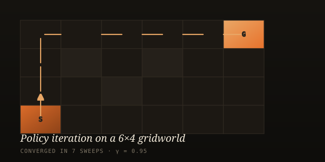

We are a small group of researchers and engineers working at the
intersection of **reinforcement learning**, **world models**, and
**robotics**. We started Tau Intelligence to do two things, deliberately,
side by side:

1. Publish research at top venues — ICML, TMLR, RLC, ICLR, AAAI, etc.
2. Help engineering teams turn that research into systems that *work*.

> [!note]
> This post doubles as a **cheatsheet**. Every section below shows a
> markdown pattern you can copy-paste into your own post under
> `/blogs`. Open [`blogs/welcome.md`](https://github.com/tau-intelligence/tau-intelligence-website/blob/main/blogs/welcome.md)
> alongside this page to see the source.

---

## Why "τ"?

τ — the Greek letter tau — is our shorthand for **Trustworthy Autonomy
under Uncertainty**. It's a property, not a product. A system has τ when
it can act autonomously *and* knows what it doesn't know *and* fails
gracefully when reality drifts.

That is the bar we hold our own work to, and the bar we help our partners
clear.

---

## Writing posts: a cheatsheet

Every block below is plain GitHub-flavoured Markdown — no custom syntax
to learn beyond two tiny conventions (figure captions and callouts).

### Headings, emphasis, lists

Use standard `#`/`##`/`###`. **Bold**, *italic*, ~~strikethrough~~ all
work. Links are `[text](url)`. Lists:

- bullet
- another bullet
  - nested bullet

1. ordered
2. ordered

Task lists work too:

- [x] write the post
- [x] add figures
- [ ] ship it

---

### Code blocks

Triple-backtick fences with a language tag get **syntax-highlighted
automatically** and labelled with the language in the corner.

```python
import torch
import torch.nn as nn

class MLPPolicy(nn.Module):
    """A tiny stochastic policy for continuous control."""

    def __init__(self, obs_dim: int, act_dim: int, hidden: int = 256):
        super().__init__()
        self.trunk = nn.Sequential(
            nn.Linear(obs_dim, hidden), nn.SiLU(),
            nn.Linear(hidden,  hidden), nn.SiLU(),
        )
        self.mu       = nn.Linear(hidden, act_dim)
        self.log_std  = nn.Parameter(torch.zeros(act_dim))

    def forward(self, obs: torch.Tensor):
        h   = self.trunk(obs)
        dist = torch.distributions.Normal(self.mu(h), self.log_std.exp())
        return dist
```

```bash
# Train, then evaluate.
python train.py --env HalfCheetah-v4 --seed 0 --total-steps 1_000_000
python eval.py  --ckpt runs/halfcheetah/best.pt --episodes 25
```

```json
{
  "env": "HalfCheetah-v4",
  "algo": "SAC",
  "lr": 3e-4,
  "gamma": 0.99
}
```

Inline code uses single backticks: e.g. `policy.forward(obs)` returns a
`torch.distributions.Normal`.

> [!tip]
> Languages we have ready out of the box include `python`, `bash`, `json`,
> `yaml`, `cpp`, `rust`, `go`, `js`, `ts`, `html`, `css`, `sql`,
> `markdown`, `dockerfile`, `diff` and ~25 others. Just tag the fence.

---

### Math

Use single dollars for inline math and double for display blocks. Both
are rendered with **KaTeX**, loaded only when the post needs it.

The Bellman optimality operator $\mathcal{T}^*$ is a contraction in
$\ell_\infty$:

$$
\mathcal{T}^* V(s) \;=\; \max_{a \in \mathcal{A}} \Big[ r(s, a) + \gamma \, \mathbb{E}_{s' \sim P(\cdot \mid s, a)} V(s') \Big].
$$

For policy gradient, the score-function estimator is

$$
\nabla_\theta J(\theta) \;=\; \mathbb{E}_{\tau \sim \pi_\theta}\!\left[ \sum_{t=0}^{T} \nabla_\theta \log \pi_\theta(a_t \mid s_t)\, \hat{A}_t \right].
$$

---

### Figures with captions

Two intuitive ways. **Pick whichever you prefer** — both render the same.

**Option 1 — markdown title attribute.** Drop a third argument in the
parentheses; it becomes the caption automatically:

```markdown

```


**Option 2 — italic line right below the image.** Often easier to edit:

```markdown

*Figure 2. Mean episode return over training; ribbon = ±1 std over 5 seeds.*
```


*Figure 2. Mean episode return over training; ribbon = ±1 std over 5 seeds.*

---

### Side-by-side figure rows

Wrap multiple images in a `:::figures` … `:::` block. They flow into a
responsive grid.

```markdown
:::figures
")

:::
```

:::figures
")

:::

---

### Callouts (admonitions)

GitHub-flavoured admonitions, six flavours. Drop them anywhere.

```markdown
> [!note]
> Useful information that complements the main thread.

> [!tip]
> A small idea that makes things better or easier.

> [!important]
> Key fact the reader must not miss.

> [!warning]
> Sharp edge — proceed with care.

> [!danger]
> Definitely do not do this in production.

> [!info]
> Side context that's nice but not essential.
```

> [!note]
> Useful information that complements the main thread.

> [!tip]
> A small idea that makes things better or easier.

> [!important]
> Key fact the reader must not miss.

> [!warning]
> Sharp edge — proceed with care. Off-policy evaluation lies to you when
> the behaviour policy doesn't cover the target's support.

> [!danger]
> Don't ship a learned controller without an interpretable safety filter.

> [!info]
> Both `> [!NOTE]` (uppercase) and `> [!note]` (lowercase) work — same
> as on GitHub.

---

### Tables

Standard pipe-tables, GFM. Right/left/center align with `:` in the
separator row.

| Method        | Sample efficiency | Wall-clock | Stable? |
| :------------ | :---------------: | ---------: | :-----: |
| PPO           |       medium      |       fast |    ✓    |
| SAC           |        high       |     medium |    ✓    |
| Model-based   |     very high     |       slow |    ~    |

---

### Block quotes

Used for pull-quotes that don't need an icon:

> "Trustworthy autonomy is the property a system gains when it can act
> *and* doubt itself in the same breath."

---

### Collapsible sections

Use a `<details>` / `<summary>` block — works inline in markdown:

```html
<details>
<summary>Click to see the full hyperparameter table</summary>

| Param        | Value   |
| ------------ | ------- |
| `lr`         | 3e-4    |
| `gamma`      | 0.99    |
| `batch_size` | 256     |

</details>
```

<details>
<summary>Click to see the full hyperparameter table</summary>

| Param        | Value   |
| ------------ | ------- |
| `lr`         | 3e-4    |
| `gamma`      | 0.99    |
| `batch_size` | 256     |

</details>

---

### Embedded video

Raw HTML `<iframe>` works inside markdown. Drop a YouTube embed or
similar:

```html
<iframe src="https://www.youtube.com/embed/dQw4w9WgXcQ"
        title="Talk title"
        allowfullscreen></iframe>
```

---

### Diff blocks

```diff
- old_value = 0.95
+ new_value = 0.99   # use a higher discount for long-horizon tasks
```

---

### Citing a post

Every markdown post automatically gets a **"Cite this post"** block at
the very bottom (you can see it just below this section). It exposes
both a plain-text citation and a BibTeX entry, each with a one-click
**Copy** button.

You don't have to do anything to enable it — values are inferred from
the post's frontmatter. To customise:

```markdown
---
title:   Your post title
date:    2025-04-12
author:  Your Name
# Optional citation overrides:
bibtex_key: yourname_short_2025      # default: tauintelligence_<slug>_<year>
doi:        10.5281/zenodo.0000000   # added to the BibTeX entry if set
url:        https://tau-intelligence.com/blog.html?slug=your-post
                                     # default: the page's own URL
# Or supply a fully formed entry yourself:
bibtex: |
  @article{yourname2025post,
    title  = {Your Post Title},
    author = {Doe, Jane and Smith, John},
    year   = {2025},
    journal = {Tau Intelligence (blog)},
    url    = {https://tau-intelligence.com/blog.html?slug=your-post}
  }
# Set `cite: false` to hide the block on a particular post.
---
```

> [!tip]
> Provide a `bibtex_key` you'd actually like to type — short, lowercase,
> no spaces. Everything else can stay on its defaults.

---

## What's next

Expect writeups on:

- learned simulators built from 3D / 4D Gaussian splats,
- offline and model-based RL methods that survive distribution shift,
- and the unglamorous engineering required to deploy any of it on a real
  robot.

If you're working on something in this space and want to compare
notes — our [contact details](../about.html#contact) are on the about
page.

